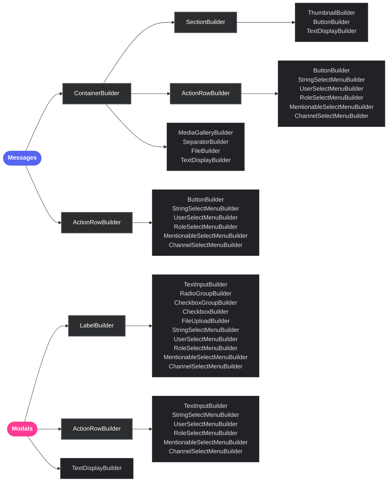

<div align="center">
  

  <h3>Type-safe Discord Components V2 builders, built for Bun</h3>

  <p>
    <a href="https://npmjs.com/package/@buncord/builders"></a>
    <a href="https://bun.sh"></a>
    <a href="https://www.typescriptlang.org"></a>
    <a href="LICENSE"></a>
  </p>

  <p>
    
    
    
  </p>

  <p>
    <b>Every</b> Discord component, including only the newest modal ones.<br />
    Invalid layouts fail <b>while you type</b>, not in production.<br />
    <b>Zero</b> dependencies, <b>zero-copy</b> serialization.
  </p>
</div>

---

## The problem

Your bot builds the same button payload thousands of times a second, and the usual builder
libraries re-run a validation schema on every single one. You pay for that in CPU, and you
still only find out at runtime that a link button cannot carry a `custom_id`.

`@buncord/builders` moves structural safety to the **type level** and keeps the runtime path
down to what it has to be: allocate the payload, hand it to `JSON.stringify`.

```ts
const row = new ActionRowBuilder({
  components: [
    new ButtonBuilder({ style: ButtonStyle.Link, url: 'https://bun.sh', customId: 'oops' }),
  ],
});
//                                                                      ~~~~~~~~
// Argument of type '{ ... }' is not assignable to parameter of type
//   '... & { readonly error: "Link button must not have a customId or custom_id property" }'
```

No schema, no decorators, no build step. The error *is* the type.

---

## Install

```bash
bun add @buncord/builders
```

> [!NOTE]
> Requires **Bun >= 1.1.0** and **TypeScript 5.x**.
---

## A complete message in 30 seconds

```ts
import {
  ActionRowBuilder,
  ButtonBuilder,
  ButtonStyle,
  ContainerBuilder,
  MessageFlags,
  SeparatorBuilder,
  TextDisplayBuilder,
} from '@buncord/builders';

const container = new ContainerBuilder({ accentColor: [255, 59, 146] }).addComponents(
  new TextDisplayBuilder({ content: '# You have encountered a wild coyote!' }),
  new SeparatorBuilder({ divider: true }),
  new ActionRowBuilder({
    components: [
      new ButtonBuilder({ customId: 'pet', label: 'Pet it!', style: ButtonStyle.Primary }),
      new ButtonBuilder({ customId: 'feed', label: 'Feed it', style: ButtonStyle.Secondary }),
      new ButtonBuilder({ customId: 'run', label: 'Run away!', style: ButtonStyle.Danger }),
    ],
  }),
);

await fetch(webhookUrl, {
  method: 'POST',
  headers: { 'Content-Type': 'application/json' },
  body: JSON.stringify({
    flags: MessageFlags.IsComponentsV2,
    components: [container.toJSON()],
  }),
});
```

More runnable examples live in [`/exemples`](./exemples).

---

## What you actually get

<table>
<tr>
<td width="50%" valign="top">

### Errors before you run

Component structure, string lengths, array sizes and option combinations are checked by the
type system. `customId` literals flow through the whole tree, so you can type your interaction
handlers straight from the layout.

```ts
type Ids = ExtractButtonIds<typeof row>;
// -> 'pet' | 'feed' | 'run'
```

</td>
<td width="50%" valign="top">

### Zero-copy serialization

A builder's internal payload **is** the wire payload: only the fields you set, already in
Discord's shape. `toJSON()` hands it straight back instead of rebuilding an object.

```ts
new ButtonBuilder({ customId: 'a', label: 'L' }).toJSON();
// { type: 2, style: 1, custom_id: 'a', label: 'L' }
// No undefined holes, no copy.
```

</td>
</tr>
<tr>
<td width="50%" valign="top">

### Nothing in your lockfile

Zero runtime dependencies. Your `bun.lock` gains one entry, not forty.

</td>
<td width="50%" valign="top">

### Every component, including the new ones

Containers, sections, media galleries, labels, radio groups, checkbox groups and file uploads,
modelled directly against the
[Discord component reference](https://docs.discord.com/developers/components/reference).

</td>
</tr>
</table>

> [!TIP]
> Compile-time length checks apply to **string literals**. A value typed as a plain `string`
> cannot be measured by the type system, so those cases are caught by the runtime validation in
> the setters and in `toJSON()`. You get both layers, not one.

---

## Benchmarks

**Measure the workload you actually send.** `toJSON()` produces a JavaScript object; encoding it with `JSON.stringify()` is a separate cost.

Sample generated on **2026-09-15 · Bun 1.3.14 · linux x64**. Each trial builds **100000 rows**: 50000 with one button and 50000 with one string select. The script warms up each library, alternates their order and reports measured medians and ranges. See the console output for trial counts and the CPU model. Installed comparison: `@discordjs/builders 1.14.1`.

| Work for 100000 rows | `@discordjs/builders` | `@buncord/builders` |
| :--- | ---: | ---: |
| Construction | 136.49 ms | 20.49 ms |
| Conversion with `toJSON()` | 43.75 ms | 15.75 ms |
| Construction + conversion | 184.14 ms | **38.12 ms** |
| JSON encoding | 23.95 ms | 29.82 ms |
| Construction + conversion + encoding | 205.31 ms | **64.99 ms** |

That is approximately **4.8× throughput** for construction and conversion on this sample, or **0.381 µs per row**. Phase medians need not sum to the total median. Payload equality is checked before timing and encoded outputs are consumed. This excludes HTTP and Discord processing. Hardware, GC, runtime, payload and validation behavior affect results; this is not a latency guarantee or an equivalent-validation comparison.

```sh
bun run benchmark:ci
```

For repeated static messages, build the payload and JSON body once and reuse them. A displayed `0.00 ms` is rounding, not zero work.

## Component Architecture



Components V2 messages must be sent with the `IS_COMPONENTS_V2` message flag:

```ts
import { MessageFlags } from '@buncord/builders';
const flags = MessageFlags.IsComponentsV2;

// Combine it with any other flag an application is allowed to set:
const ephemeral = MessageFlags.IsComponentsV2 | MessageFlags.Ephemeral;
```

When this flag is set, Discord treats components as the message body. Use `TextDisplayBuilder`
and `ContainerBuilder` instead of relying on `content` or `embeds`.

---

## Component coverage

Every component type a bot is allowed to send is implemented.

| | Builder | ID | Available in |
|:-:|:-----|:--:|:------------|
| | `ActionRowBuilder` | 1 | Messages, Modals |
| | `ButtonBuilder` | 2 | Messages, Section accessory |
| | `StringSelectMenuBuilder` | 3 | Messages, Modals |
| | `TextInputBuilder` | 4 | Modals |
| | `UserSelectMenuBuilder` | 5 | Messages, Modals |
| | `RoleSelectMenuBuilder` | 6 | Messages, Modals |
| | `MentionableSelectMenuBuilder` | 7 | Messages, Modals |
| | `ChannelSelectMenuBuilder` | 8 | Messages, Modals |
| | `SectionBuilder` | 9 | Messages |
| | `TextDisplayBuilder` | 10 | Messages, Modals |
| | `ThumbnailBuilder` | 11 | Messages |
| | `MediaGalleryBuilder` | 12 | Messages |
| | `FileBuilder` | 13 | Messages |
| | `SeparatorBuilder` | 14 | Messages |
| | `ContainerBuilder` | 17 | Messages |
| | `LabelBuilder` | 18 | Modals |
| | `FileUploadBuilder` | 19 | Modals |
| | `RadioGroupBuilder` | 21 | Modals |
| | `CheckboxGroupBuilder` | 22 | Modals |
| | `CheckboxBuilder` | 23 | Modals |

Plus `SmartLayoutBuilder`, which packs buttons into rows of five and gives every select menu its
own row, and `ComponentFactory`, which rebuilds a typed builder from a raw Discord payload.

---

## Validation and auditing

Two layers, for two different moments.

**`toJSON()` throws.** Use it when you are about to send: missing required fields, illegal
children and out-of-range values stop the payload from leaving your process.

**`auditTree()` never throws.** Use it in tests, in CI, or behind a debug flag to get every
problem at once, with a path and a suggested fix.

```ts
import { BaseComponent } from '@buncord/builders';

for (const issue of BaseComponent.auditTree(payload, { structured: true })) {
  console.warn(`[${issue.severity}] ${issue.code} at ${issue.path || '(root)'}`);
  console.warn(`  ${issue.message}`);
  console.warn(`  fix: ${issue.fix}`);
}
```

```text
[error] LINK_BUTTON_MISSING_URL at components[0]
  Button with style Link (5) must have a url property
  fix: Call .setURL() with a valid URL on this button
```

The auditor checks the per-message component and text budgets, duplicate `customId`s, missing
required fields, character overflows, mixed ActionRow contents, illegal Container and Section
children, Section accessories, select menu `default_values` types, and File Upload bounds. Every
rule is tied to a published constraint in the
[Discord component reference](https://docs.discord.com/developers/components/reference).

---

## Serialization contract

`toJSON()` is zero-copy: it may return the builder's own internal payload rather than a copy,
which is where most of the speed advantage comes from. Treat the result as read-only, and use
`clone()` when you need an independently editable copy.

```ts
const base = new ButtonBuilder({ customId: 'page:1', label: 'Page 1', style: ButtonStyle.Primary });
const next = base.clone().setCustomId('page:2').setLabel('Page 2'); // safe
```

`toJSON()` never mutates the builder, and the payload only ever contains fields you actually
set, so nothing superfluous is sent to Discord.

---

## Coming from @discordjs/builders

The surface is deliberately familiar, with two differences worth knowing.

| | `@discordjs/builders` | `@buncord/builders` |
|:--|:--|:--|
| Construction | chained setters | options object **or** chained setters |
| Validation | runtime schema on every build | types first, runtime as the backstop |
| Runtime dependencies | several | none |

```ts
// This still works exactly as you expect:
const button = new ButtonBuilder()
  .setCustomId('confirm')
  .setLabel('Confirm')
  .setStyle(ButtonStyle.Success);

// And this is the form that unlocks literal inference:
const typed = new ButtonBuilder({ customId: 'confirm', label: 'Confirm', style: ButtonStyle.Success });
```

---

## Examples

| Example | What it shows |
|:--------|:------------|
| [`quick-start.ts`](./exemples/quick-start.ts) | A full Components V2 message payload |
| [`smart-layout.ts`](./exemples/smart-layout.ts) | Auto-packing buttons and select menus into rows |
| [`modals.ts`](./exemples/modals.ts) | Text inputs, radio groups, checkboxes and file upload |
| [`validation.ts`](./exemples/validation.ts) | Runtime validation and `auditTree()` diagnostics |
| [`webhook.ts`](./exemples/webhook.ts) | Sending a payload to a Discord webhook |

```bash
bun run exemples/quick-start.ts
```

---

## Development

```bash
bun install          # install dependencies
bun test             # run the suite
bun test --coverage  # run it with coverage
bun run typecheck    # strict TypeScript check
bun run benchmark:ci # reproduce the benchmark
```

See [CONTRIBUTING.md](./CONTRIBUTING.md) for more details.

---

<div align="center">

MIT licensed. Built by [buncord's team](https://github.com/sqlu).

<sub>The tests, JSDocs and code comments in this repository were generated by an AI and subsequently reviewed and reworked by a human.</sub>

</div>
