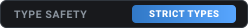
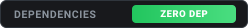
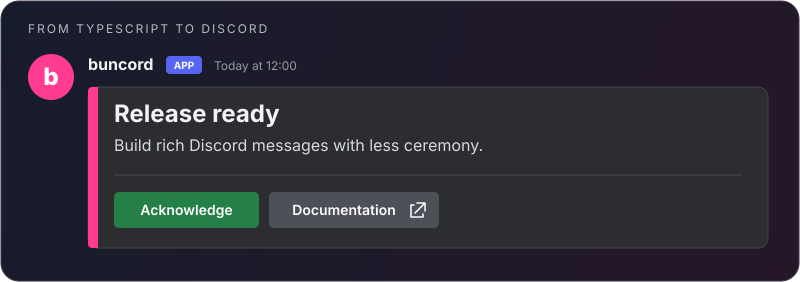
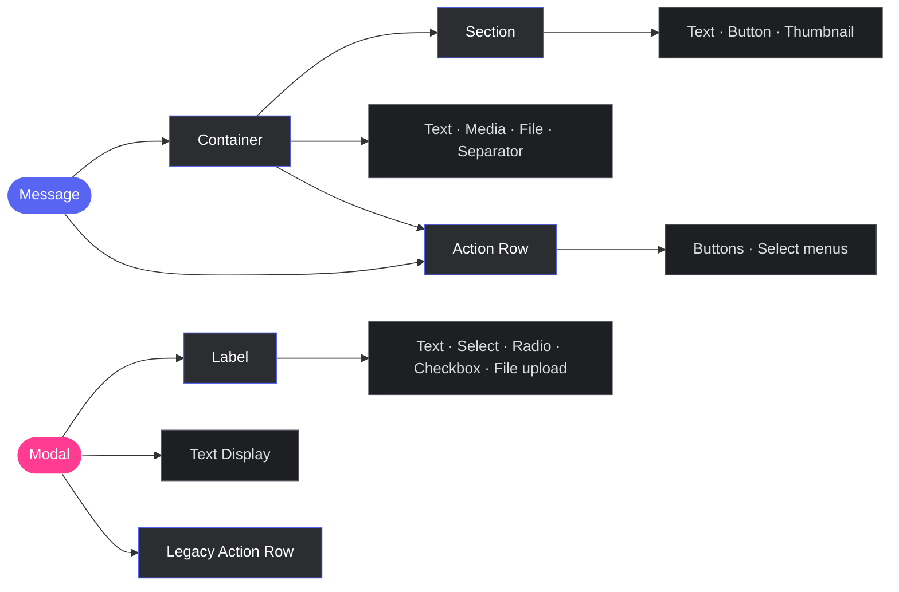

<div align="center">
  

  <h3>Discord component builders made for Bun</h3>

  <p>
    Build every Discord Components V2 message and modal with strict TypeScript,<br />
    fast serialization, actionable errors, and zero runtime dependencies.
  </p>

  <p>
    <a href="https://npmjs.com/package/@buncord/builders"></a>
    <a href="https://bun.sh"></a>
    <a href="https://www.typescriptlang.org"></a>
    <a href="./LICENSE"></a>
  </p>

  <p>
    
    
    
  </p>

  <p>
    <a href="#install">Install</a> ·
    <a href="#quick-start">Quick start</a> ·
    <a href="#json-to-typescript">Code generator</a> ·
    <a href="#validation-you-can-use">Validation</a> ·
    <a href="#benchmarks">Benchmarks</a> ·
    <a href="#component-architecture">Components</a>
  </p>
</div>

---

## Why this package exists

Discord components are small payloads, but general-purpose builder libraries often put a runtime
schema between your code and every payload. `@buncord/builders` takes a narrower approach for Bun:

- invalid literal combinations fail in TypeScript;
- dynamic values are checked again at runtime;
- builders serialize directly to Discord's wire shape;
- every component validation error carries a stable machine-readable code;
- no runtime dependency is added to `bun.lock`.

The package deliberately supports **Bun only**. It ships TypeScript source, exposes a Bun CLI, and
fails early when imported from another runtime. That focus keeps the package small and its support
surface explicit.

<table>
<tr>
<td align="center" width="25%"><strong>20 component types</strong><br /><sub>Messages and modals</sub></td>
<td align="center" width="25%"><strong>Types + runtime</strong><br /><sub>Two validation layers</sub></td>
<td align="center" width="25%"><strong>0 dependencies</strong><br /><sub>Only your package</sub></td>
<td align="center" width="25%"><strong>Bun native workflow</strong><br /><sub>Source, tests and CLI</sub></td>
</tr>
</table>

## Install

```bash
bun add @buncord/builders
```

Requirements: **Bun 1.1 or newer** and **TypeScript 5.x** for compile-time diagnostics.

## Quick start

```ts
import {
  ActionRowBuilder,
  ButtonBuilder,
  ButtonStyle,
  ContainerBuilder,
  MessageFlags,
  SeparatorBuilder,
  TextDisplayBuilder,
} from '@buncord/builders';

const components = [
  new ContainerBuilder({ accentColor: [255, 59, 146] }).addComponents(
    new TextDisplayBuilder({
      content: '# Release ready\nBuild rich Discord messages with less ceremony.',
    }),
    new SeparatorBuilder({ divider: true }),
    new ActionRowBuilder({
      components: [
        new ButtonBuilder({
          customId: 'release:confirm',
          label: 'Confirm',
          style: ButtonStyle.Success,
        }),
        new ButtonBuilder({
          label: 'Documentation',
          style: ButtonStyle.Link,
          url: 'https://docs.discord.com/developers/components/reference',
        }),
      ],
    }),
  ).toJSON(),
];

await fetch(webhookUrl, {
  method: 'POST',
  headers: { 'Content-Type': 'application/json' },
  body: JSON.stringify({
    flags: MessageFlags.IsComponentsV2,
    components,
  }),
});
```

<div align="center">
  
</div>

Components V2 messages require `MessageFlags.IsComponentsV2`. When this flag is present, Discord
uses components as the message body instead of legacy `content` and `embeds` fields.

## Errors before Discord sees the payload

The constructor API keeps literal information long enough for TypeScript to reject invalid
combinations:

```ts
new ButtonBuilder({
  style: ButtonStyle.Link,
  url: 'https://bun.sh',
  customId: 'not-allowed',
  // Type error: Link buttons cannot carry customId or custom_id.
});
```

Values typed as a general `string` or `number` cannot always be checked by TypeScript. Setters and
`toJSON()` therefore validate them at runtime as well.

```ts
import { isComponentError } from '@buncord/builders';

try {
  component.toJSON();
} catch (error) {
  if (isComponentError(error)) {
    console.error(error.code);
    console.error(error.path);
    console.error(error.fix);
  }
}
```

Every validation failure raised by a builder or by the component-tree validator is a regular
`Error` carrying non-enumerable metadata. Existing logging behavior stays familiar:
`instanceof Error` works, `Object.keys(error)` stays empty, and `JSON.stringify(error)` stays `{}`.
Rules explicitly linked across the builder and auditor use the same code. Every other builder
failure uses a stable builder-family code instead of falling back to unstructured prose.

## JSON to TypeScript

Turn a raw Discord payload into editable constructor code:

```bash
bunx buncord-builders generate payload.json --name release --output Release.ts
```

<table>
<tr>
<th width="50%" align="left">Input payload</th>
<th width="50%" align="left">Generated TypeScript</th>
</tr>
<tr>
<td valign="top">

```json
{
  "type": 1,
  "components": [
    {
      "type": 2,
      "style": 1,
      "custom_id": "confirm",
      "label": "Confirm"
    }
  ]
}
```

</td>
<td valign="top">

```ts
export const component = new ActionRowBuilder({
  components: [
    new ButtonBuilder({
      style: ButtonStyle.Primary,
      customId: "confirm",
      label: "Confirm",
    }),
  ],
});
```

</td>
</tr>
</table>

The generator uses real constructors, so generated files retain the same
compile-time guards as handwritten code. Unknown component fields are rejected instead of being
silently discarded. The round-trip test executes generated code for all 20 supported component
types and compares the resulting payload.

You can also call the generator directly:

```ts
import { generateComponentCode } from '@buncord/builders';

const source = generateComponentCode(payload, {
  variableName: 'release',
  moduleName: '@buncord/builders',
});
```

## Validation you can use

`auditTree()` collects every issue it can find without throwing. It is suitable for CI, migration
scripts, support tools, and debugging raw payloads.

```ts
import { BaseComponent } from '@buncord/builders';

const issues = BaseComponent.auditTree(payload, { structured: true });
for (const issue of issues) {
  console.warn(`${issue.code} at ${issue.path || '(root)'}`);
  console.warn(issue.fix);
}
```

The same checks are available from the CLI:

```bash
bunx buncord-builders validate payload.json
bunx buncord-builders explain payload.json
bunx buncord-builders explain payload.json --json
bunx buncord-builders validate modal.json --context modal
cat payload.json | bunx buncord-builders validate -
```

| Exit code | Meaning |
| :--: | :-- |
| `0` | Valid payload |
| `1` | Discord component validation failed |
| `2` | Invalid command, unreadable file, or malformed JSON |

The auditor checks required fields, component and text budgets, duplicate `custom_id` values,
container layouts, section accessories, Action Row combinations, modal inputs, select defaults,
integer bounds, file uploads, and cyclic trees.

### Specification provenance

Discord does not publish a versioned component schema. The package therefore records when its
constraints were checked and separates the official reference from community material:

```ts
import { SPEC_PROVENANCE } from '@buncord/builders';

SPEC_PROVENANCE.verifiedOn;
SPEC_PROVENANCE.primaryReference;
SPEC_PROVENANCE.secondaryReferences;
SPEC_PROVENANCE.exceptions;
```

The authoritative source is the
[Discord component reference](https://docs.discord.com/developers/components/reference). Any rule
that cannot be proven from that reference is listed explicitly in `SPEC_PROVENANCE.exceptions` and
pinned by a regression test.

## Benchmarks



**Measure the workload you actually send.** `toJSON()` produces a JavaScript object; encoding it with `JSON.stringify()` is a separate cost.

Sample generated on **2026-09-16 · Bun 1.4.2 · linux x64**. Each trial builds **100000 rows**: 50000 with one button and 50000 with one string select. The script warms up each library, alternates their order and reports measured medians and ranges. See the console output for trial counts and the CPU model. Installed comparison: `@discordjs/builders 1.14.1`.

| Work for 100000 rows | `@discordjs/builders` | `@buncord/builders` |
| :--- | ---: | ---: |
| Construction | 135.38 ms | 18.26 ms |
| Conversion with `toJSON()` | 49.65 ms | 16.27 ms |
| Construction + conversion | 181.10 ms | **33.84 ms** |

That is approximately **5.4× throughput** for construction and conversion on this sample, or **0.338 µs per row**. Phase medians need not sum to the total median. Payload equality is checked before timing and encoded outputs are consumed. This excludes HTTP and Discord processing. Hardware, GC, runtime, payload and validation behavior affect results; this is not a latency guarantee or an equivalent-validation comparison.

```sh
bun run benchmark:ci
```

Both libraries produce byte-identical JSON for these rows, so `JSON.stringify` is the engine's cost rather than the library's and is not charted. Measured on its own, with the heap collected between runs and the order alternated, encoding lands at parity: 34.46 ms against 35.47 ms over 100000 rows.

For repeated static messages, build the payload and JSON body once and reuse them. A displayed `0.00 ms` is rounding, not zero work.

## Component Architecture



### Component coverage

| Context | Builders |
| :-- | :-- |
| Layout | `ActionRowBuilder`, `SectionBuilder`, `ContainerBuilder`, `LabelBuilder` |
| Content | `TextDisplayBuilder`, `ThumbnailBuilder`, `MediaGalleryBuilder`, `FileBuilder`, `SeparatorBuilder` |
| Interactive | `ButtonBuilder`, five select-menu builders |
| Modal inputs | `TextInputBuilder`, `FileUploadBuilder`, `RadioGroupBuilder`, `CheckboxGroupBuilder`, `CheckboxBuilder` |
| Utilities | `ModalBuilder`, `SmartLayoutBuilder`, `ComponentFactory` |

All 20 component types bots can currently send are implemented. Discord's non-sendable
`CONTENT_INVENTORY_ENTRY` (16) and `CHECKPOINT_CARD` (20) values remain available in
`ComponentType`, without builders that would imply bot support.

## Serialization contract

`toJSON()` returns a minimal Discord payload and never mutates the builder. Depending on the
component, it may return its internal data or construct a payload while serializing nested
builders. Treat returned payloads as read-only unless you explicitly clone them.

```ts
const first = new ButtonBuilder({
  customId: 'page:1',
  label: 'Page 1',
  style: ButtonStyle.Primary,
});
const second = first.clone().setCustomId('page:2').setLabel('Page 2');
```

Unset optional values are omitted. Nested builders are converted to Discord's snake_case wire
format only when serialized.

## Familiar API, stronger types

The API intentionally resembles `@discordjs/builders`, while constructor options preserve literal
types for stronger diagnostics.

```ts
const familiar = new ButtonBuilder()
  .setCustomId('confirm')
  .setLabel('Confirm')
  .setStyle(ButtonStyle.Success);

const inferred = new ButtonBuilder({
  customId: 'confirm',
  label: 'Confirm',
  style: ButtonStyle.Success,
});

type ButtonIds = ExtractButtonIds<typeof inferred>; // 'confirm'
```

Use `ComponentFactory.from()` when rebuilding runtime builders from raw payloads. Use the CLI when
you want editable TypeScript source with compile-time validation.

## Examples

| File | Demonstrates |
| :-- | :-- |
| [`quick-start.ts`](./exemples/quick-start.ts) | Complete Components V2 message |
| [`smart-layout.ts`](./exemples/smart-layout.ts) | Automatic Action Row packing |
| [`modals.ts`](./exemples/modals.ts) | Current modal input components |
| [`validation.ts`](./exemples/validation.ts) | Runtime validation and auditing |
| [`webhook.ts`](./exemples/webhook.ts) | Sending a webhook payload |

```bash
bun run exemples/quick-start.ts
```

## Development

```bash
bun install
bun run typecheck
bun test
bun run benchmark:ci
bun run benchmark:payload -- --verify-only
```

The project uses strict TypeScript with `exactOptionalPropertyTypes`,
`noUncheckedIndexedAccess`, and `isolatedModules`. See [CONTRIBUTING.md](./CONTRIBUTING.md) before
submitting a change.

---

<div align="center">
  <strong>Bun only. Discord focused. MIT licensed.</strong><br />
  <sub>Built by <a href="https://github.com/sqlu">buncord's team</a>.</sub>

  <br /><br />

  <sub>The tests, JSDocs and code comments in this repository were generated by an AI and subsequently reviewed and reworked by a human.</sub>
</div>
